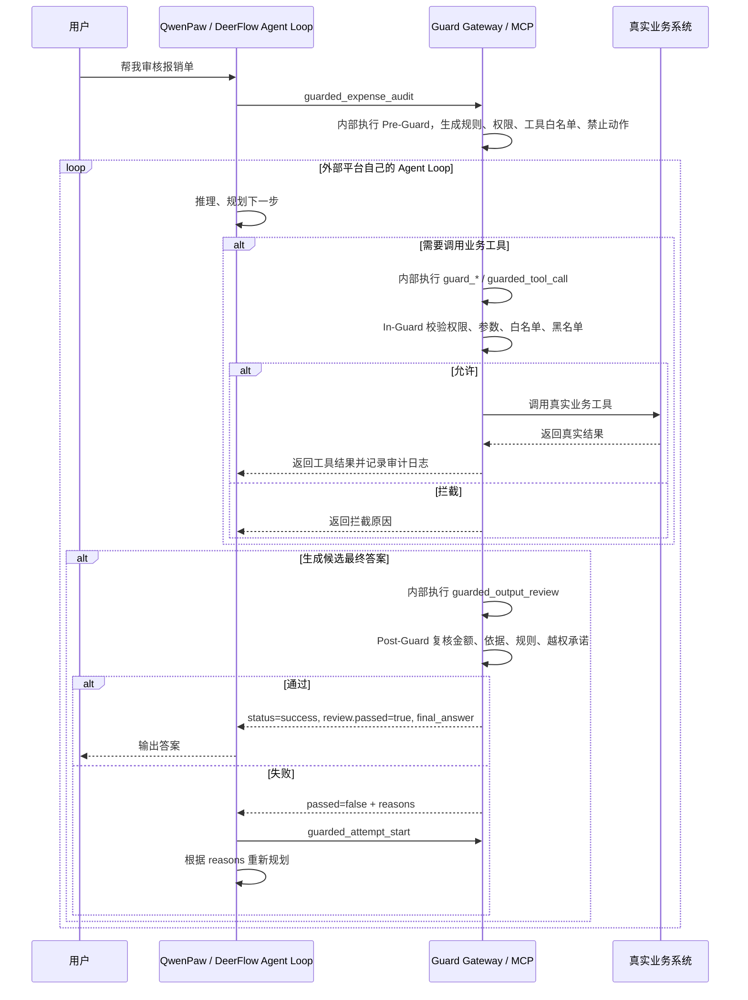

# Guarded Agent Runtime

Guarded Agent Runtime 是一个给外部 Agent 平台接入的受控执行网关。它不替代 QwenPaw、DeerFlow 这类平台里的 Agent，而是接管业务执行链路中的三个关键位置：

```text
事前约束：平台开始执行前，先向网关领取规则、权限、工具白名单和禁止动作。
事中拦截：平台调用业务工具时，必须先经过网关校验，不能直连真实业务系统。
事后复核：平台生成最终答案后，必须交给网关复核，通过后再展示给用户。
```

## QwenPaw / DeerFlow 中的调用位置



最推荐的接入方式是让 QwenPaw 调用一站式工具 `guarded_expense_audit`。这个工具内部会强制完成事前约束、事中拦截和事后复核。

如果使用低层分步工具，才需要分别调用：

```text
任务开始时：调用 guarded_context_build。
每次业务工具调用前：调用 guard_* 或 guarded_tool_call。
每次候选最终答案输出前：调用 guarded_output_review。
每次复核失败后要重试：调用 guarded_attempt_start。
```

## 关键边界

如果用户在 QwenPaw、DeerFlow 里提问，平台不会自动调用本项目。必须把本项目注册成 MCP Server、HTTP Tool、插件、middleware 或 workflow 节点。

业务工具不要直接注册给平台：

```text
read_expense_form
approve_payment
modify_budget
```

应该只暴露网关工具：

```text
guarded_expense_audit
guarded_context_build
guard_list_expense_forms
guard_read_expense_form
guard_check_invoice
guard_calculate_reimbursement
guard_generate_audit_opinion
guarded_output_review
```

如果平台仍然能绕过网关直接调用付款、预算、数据库、文件系统或 Shell，网关拦不到。必须禁用、收窄或替换这些直接工具。

## 项目结构

```text
guarded-agent-runtime/
├── app.py
├── external_platform_demo.py
├── mcp_smoke_test.py
├── gateway/
│   ├── service.py
│   ├── server.py
│   ├── mcp_server.py
│   └── logging_config.py
├── guards/
│   ├── pre_guard.py
│   ├── in_guard.py
│   └── post_guard.py
├── tools/
│   ├── expense_tools.py
│   └── tool_registry.py
├── policies/
│   ├── rules.py
│   ├── permissions.py
│   ├── policy_loader.py
│   └── guard_policies.py
├── runtime/
│   ├── executor.py
│   └── sandbox.py
├── config/
│   └── policies/
│       ├── users.json
│       ├── business_rules.json
│       ├── pre_guard.json
│       ├── in_guard.json
│       └── post_guard.json
├── integrations/
│   ├── qwenpaw_mcp_config.example.json
│   └── qwenpaw_agent_instructions.md
├── data/
│   └── sample_expense.json
├── requirements.txt
├── USAGE.md
└── README.md
```

## 快速使用

详细步骤见 [USAGE.md](./USAGE.md)。

如果你要接 QwenPaw，优先看 [USAGE.md](./USAGE.md) 里的“完整使用流程”。核心顺序是：

```text
本地跑 mcp_smoke_test
打开 logs/guard_gateway.log 实时监听
在 QwenPaw 里导入 MCP JSON
优先让 QwenPaw 调用 guarded_expense_audit
重启或刷新 QwenPaw MCP 客户端
在 QwenPaw 提问“帮我审核报销单”
看日志确认 guarded_expense_audit 内部的 context_build、tool_call、output_review 是否发生
```

本地验证 MCP：

```bash
python mcp_smoke_test.py
```

注意：`python -m gateway.mcp_server` 启动的是 stdio MCP Server。单独在终端运行时，它会等待 MCP Client 连接，看起来可能像“没有日志”。要验证它是否可用，请运行 `python mcp_smoke_test.py`，或者从 QwenPaw 的 MCP 客户端连接它。

查看运行日志：

```powershell
Get-Content .\logs\guard_gateway.log -Wait -Encoding UTF8
```

查看结构化审计日志：

```powershell
Get-Content .\logs\audit.jsonl -Wait -Encoding UTF8
```

启动 HTTP 网关：

```bash
python app.py --host 127.0.0.1 --port 8765
```

模拟外部平台接入后的调用链：

```bash
python external_platform_demo.py
```

## 自定义规则

规则文件在：

```text
config/policies/
```

各文件职责：

```text
users.json           用户、角色、权限、用户别名
business_rules.json  报销业务规则，例如项目限额、不可计入项目A的费用类型
pre_guard.json       事前约束规则，例如任务关键词、注入给模型的约束说明
in_guard.json        事中拦截规则，例如工具白名单、参数校验、权限校验、禁止动作
post_guard.json      事后复核规则，例如必需工具依据、必需输出字段、越权承诺短语
```

HTTP 模式下修改后调用：

```text
POST /policies/reload
```

MCP 模式下调用：

```text
guarded_policy_reload
```
