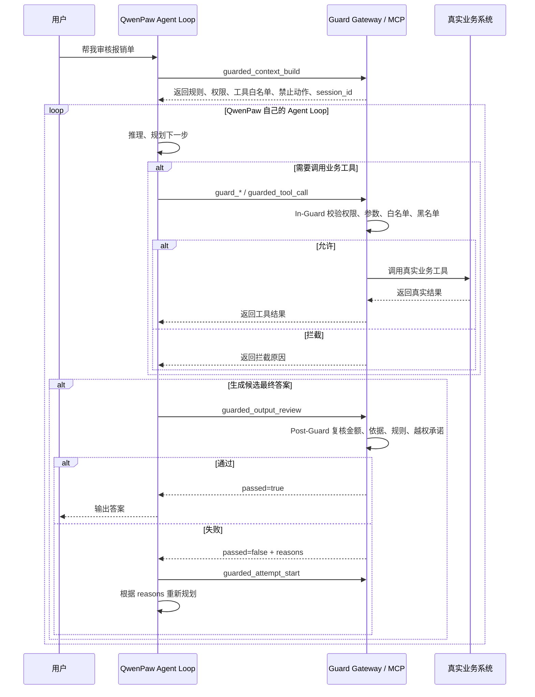

# 使用文档

这份文档说明如何把 Guarded Agent Runtime 用作外部 Agent 平台的受控业务工具网关，重点以 QwenPaw 接入为例。

## 1. 安装依赖

HTTP 网关只使用 Python 标准库。MCP 接入需要 `mcp` 包。

```bash
cd E:\.Aproject\desktop\Ontology\guarded-agent-runtime
pip install -r requirements.txt
```

如果当前环境已经有 `mcp`，可以直接跳过安装。

## 2. 本地确认 MCP Server 可用

执行：

```bash
python mcp_smoke_test.py
```

正常结果会列出这些工具：

```text
guarded_context_build
guarded_tool_call
guard_read_expense_form
guard_check_invoice
guard_calculate_reimbursement
guard_generate_audit_opinion
guarded_output_review
guarded_attempt_start
guarded_audit_logs
guarded_policy_reload
```

这一步通过后，说明 QwenPaw 也可以用同样的命令启动这个 MCP Server。

## 3. 在 QwenPaw 中添加 MCP Server

如果 QwenPaw 支持 `mcpServers` 配置，参考：

```json
{
  "mcpServers": {
    "guarded-agent-runtime": {
      "command": "python",
      "args": ["-m", "gateway.mcp_server"],
      "cwd": "E:\\.Aproject\\desktop\\Ontology\\guarded-agent-runtime",
      "env": {
        "PYTHONIOENCODING": "utf-8",
        "PYTHONDONTWRITEBYTECODE": "1"
      }
    }
  }
}
```

同样的示例文件在：

```text
integrations/qwenpaw_mcp_config.example.json
```

如果 QwenPaw 是 UI 里添加 MCP，填写：

```text
名称：guarded-agent-runtime
命令：python
参数：-m gateway.mcp_server
工作目录：E:\.Aproject\desktop\Ontology\guarded-agent-runtime
环境变量：
  PYTHONIOENCODING=utf-8
  PYTHONDONTWRITEBYTECODE=1
```

如果 QwenPaw 在 Docker、WSL 或远程服务器里运行，`cwd` 要改成那个环境能访问到的项目路径。

## 4. 给 QwenPaw Agent 加执行约束

把下面文件里的内容加入 QwenPaw 对应 Agent 的 system prompt 或 instructions：

```text
integrations/qwenpaw_agent_instructions.md
```

核心要求是：

```text
收到业务请求后，先调用 guarded_context_build。
调用业务工具时，必须携带 session_id。
最终答案必须调用 guarded_output_review。
只有 review passed=true，才输出给用户。
```

## 4.1 QwenPaw Agent Loop 中什么时候调用网关

QwenPaw 的 Agent Loop 仍然在 QwenPaw 里运行。本项目不是替代它的循环，而是作为循环里的必经检查点。



不是每个 token 都调用网关，但这几个点必须调用：

```text
任务开始时：调用 guarded_context_build。
每次业务工具调用前：调用 guard_* 或 guarded_tool_call。
每次候选最终答案输出前：调用 guarded_output_review。
每次复核失败后要重试：调用 guarded_attempt_start。
```

如果 QwenPaw 自己的内置工具在这些检查点之前就直接准备环境、开 Shell、读文件、联网或调用业务 API，本项目拦不到。要强控制，必须撤掉这些直连权限，或者在 QwenPaw 的 middleware、plugin、workflow 中强制接入网关。

## 5. 禁用或替换直连业务系统的工具

这是能不能受控的关键。

应该保留：

```text
Guard Gateway MCP 工具
普通非敏感聊天能力
必要但受限的搜索、文件、浏览器能力
```

应该禁用或替换：

```text
直接付款工具
直接修改预算工具
直接写数据库工具
直接访问报销系统 API 的工具
拥有敏感目录权限的 Shell 或文件工具
```

如果 QwenPaw 仍然能绕过 MCP 直接调用真实业务工具，本项目无法拦截。

## 6. 在 QwenPaw 中测试

用户提问：

```text
帮我审核这张差旅报销单，能报的直接生成审核意见。
```

期望工具调用顺序：

```text
guarded_context_build
guard_read_expense_form
guard_check_invoice
guard_calculate_reimbursement
guard_generate_audit_opinion
guarded_output_review
```

如果 Agent 尝试执行：

```text
approve_payment
```

只能通过 `guarded_tool_call` 提交给网关，网关会返回：

```text
拦截原因：approve_payment 属于禁止动作。
```

此时 QwenPaw 不能说“已付款”。

## 7. HTTP 网关用法

如果平台不接 MCP，但支持 HTTP Tool 或 Webhook，可以启动 HTTP 网关：

```bash
python app.py --host 127.0.0.1 --port 8765
```

### 事前约束

```text
POST /context/build
```

请求：

```json
{
  "user_id": "auditor_001",
  "user_request": "帮我审核这张差旅报销单，能报的直接生成审核意见。"
}
```

返回 `session_id`、用户权限、业务规则、工具白名单和禁止动作。

### 事中拦截

```text
POST /tools/call
```

请求：

```json
{
  "session_id": "<session_id>",
  "tool_name": "calculate_reimbursement",
  "arguments": {
    "expense_id": "EXP-2026-001",
    "project": "project_a"
  }
}
```

### 事后复核

```text
POST /review/output
```

请求：

```json
{
  "session_id": "<session_id>",
  "final_answer": {
    "status": "passed",
    "message": "项目A可报销 25000.0 元；其他渠道承担 5237.01 元；餐费、保险费不得计入项目A；本意见不执行付款。",
    "project_a_reimbursable": 25000.0,
    "other_channel_amount": 5237.01,
    "not_allowed_in_project_a": [
      {
        "name": "保险",
        "category": "insurance",
        "amount": 245.0,
        "reason": "业务规则禁止计入项目A"
      },
      {
        "name": "伙食费",
        "category": "meal",
        "amount": 2365.89,
        "reason": "业务规则禁止计入项目A"
      }
    ],
    "exceptions": [],
    "source_tools": [
      "read_expense_form",
      "check_invoice",
      "calculate_reimbursement",
      "generate_audit_opinion"
    ],
    "forbidden_commitments": []
  }
}
```

通过时返回：

```json
{
  "passed": true,
  "reasons": [],
  "action": "allow_output",
  "message": "复核通过，可以输出给用户。"
}
```

失败时返回：

```json
{
  "passed": false,
  "reasons": [
    "最终结果缺少 calculate_reimbursement 的真实工具返回依据。",
    "输出包含越权承诺：已提交付款。"
  ],
  "action": "retry_or_human_confirm"
}
```

## 8. Agent Loop 重试

如果复核失败，平台要让 Agent 重试，应先开启新轮次：

```text
POST /attempt/start
```

或 MCP 工具：

```text
guarded_attempt_start
```

这样上一轮被拦截的调用仍然保留在审计日志里，但不会阻止下一轮合规答案通过复核。

## 9. 修改规则

编辑：

```text
config/expense_policy.json
```

可以改：

```text
用户角色
用户权限
项目A限额
不能计入项目A的费用类型
禁止动作
重复发票规则
缺失票据规则
```

HTTP 模式重载：

```text
POST /policies/reload
```

MCP 模式重载：

```text
guarded_policy_reload
```

## 10. 本地模拟完整接入链路

执行：

```bash
python external_platform_demo.py
```

这个脚本模拟外部平台已经完成 MCP 或 HTTP 接入后的流程：

```text
第一轮：
  调用事前约束
  读取报销单
  尝试付款，被拦截
  提交违规答案，复核失败

第二轮：
  开启新 attempt
  核验发票
  计算报销金额
  生成审核意见
  提交复核，通过
```

## 11. 当前 Demo 的正确结果

```text
项目A可报销金额：25000.0 元
其他渠道承担金额：5237.01 元
不可计入项目A：保险 245.0 元，伙食费 2365.89 元
超出项目A限额：2626.12 元
异常项：无
```
